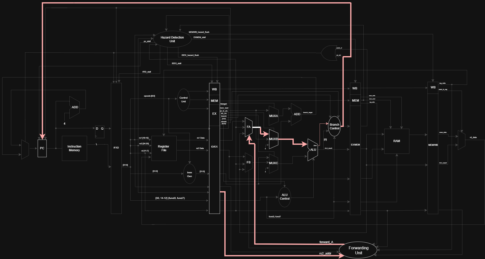
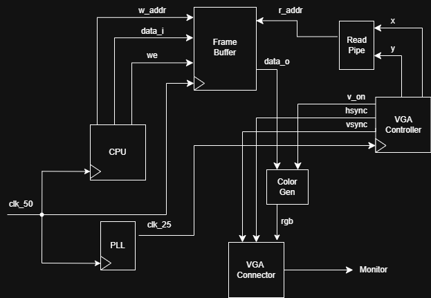

# Pipelined RISC-V SoC

This is a custom 5-stage pipelined RV32I SoC written in SystemVerilog. It runs bare-metal Pong on a DE10-Lite FPGA and outputs the game to a monitor via VGA.

<p align="center">
  
  
</p>

## What it does

The CPU runs 37/37 non-system RV32I instructions, plus EBREAK so the program can halt.

The pipeline consists of 5 stages: Instruction Fetch (IF), Instruction Decode (ID), Execute (EX), Memory (MEM), and Writeback (WB).

The FPGA's BRAM was divided into 4 sections dedicated to hold instructions (ROM), data (RAM), framebuffer data, and Memory-Mapped I/O (MMIO).

A 640x480 resolution at 2bpp was used for the display, meaning that each pixel can either be solid red, green, blue, or black. 

Pong was written in C. The .c file was compiled into a hex file using riscv64-unknown-elf commands. These commands were placed in a bash script, compile.sh, which allows the user to go from .c -> .o -> .elf -> .hex.

## Results

Max clock speed : 51.67 MHz 

Runs at : 50 MHz
 
CPI : 1.343 running Pong 

Note: The CPI was measured by counting how many instructions reached writeback, which isn't a fully rigorous method. I plan to add the Zicsr extension so I can use the mcycle and minstret counters for a proper measurement.

The critical path is shown below.



## Datapath

This is a high level diagram of the processor datapath.


This is a low level diagram of the datapath, which can be viewed more clearly from the actual file.


The VGA connector wiring diagram is shown below.



## Repo Organization

```
CPU/hdl/CPU/       The processor RTL (ALU, register file, control unit,
                   hazard detection, forwarding, pipeline buffers)
CPU/hdl/Learning/  Small practice modules from when I was learning SystemVerilog
CPU/synthesis/     Quartus project files
CPU/test/          Testbenches and assembly test programs
VGA/               VGA display interface (controller, framebuffer, PLL, color)
Pong/              The game: C source, compile script, and hex output
docs/              Design report and demo gif
```

## Memory Map

| Region | Address range | Size |
|---|---|---|
| ROM (instructions) | 0x0000 to 0x13FF | 5 kB |
| RAM (data) | 0x1400 to 0x4FFF | 15 kB |
| Framebuffer | 0x5000 to 0x17BFF | 75 kB |
| MMIO (GPIO) | 0x17C00 to 0x17C0F | 4 words |

## Building and running it

To compile the game, ensure the RISC-V toolchain (gcc-riscv64-unknown-elf) is installed. Then:

```bash
cd Pong
./compile.sh
```

That produces pong.hex, which gets loaded into ROM.

To run it on hardware, open the Quartus project in CPU/synthesis, compile it, and program the DE10-Lite. Hook up a VGA monitor and the GPIO buttons.

To simulate it, run the testbenches in CPU/test using ModelSim.

## Next Steps

- CSR Support
- Interrupts
- Branch Prediction
- M-extension
- Run DOOM
  
## References

The pipeline is based on the Patterson and Hennessy design, extended to cover all the RV32I non-system instructions. The full design report and detailed datapath diagram are in the docs folder.
